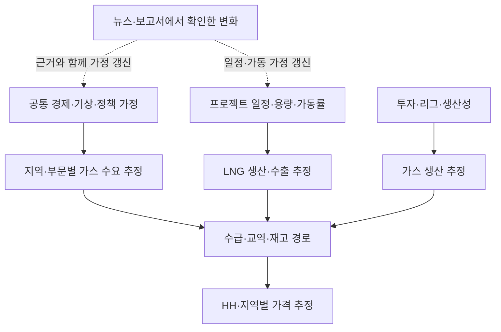

# LIORA OUTLOOK — 사인포스트를 연결하는 다단계 모델 엔진

## 1. 여기서 말하는 엔진

사용자는 **각 사인포스트를 잘 설명하는 개별 모델들이 여러 단계로 연결되고, 한 번의
실행으로 각 변수의 미래 추정이 상위 변수에 전달되어 전체 시장 시나리오를 구성하는 엔진**을
원한다. 모델 비교와 검증은 이 연결 구조를 뒷받침하는 공통 기능이다.

추가로 사용자는 미국 정책·달러·산유국 재정·OPEC 반응의 예를 통해, 동일한 조건에서도
증산·감산·유지가 각각 가능하며 각 가능성에서 다시 연계된 미래가 분기하는 구조를 설명했다.
따라서 개별 모델의 기본 출력은 **다음 상태의 조건부 확률분포**이며, 이 분포들을 연결해
확률과 근거를 가진 미래 경로를 구성해야 한다. 아래 3.5절은 이를 구현하기 위한 설계 제안이다.

핵심은 어떤 모델의 출력인 변수가 다른 모델에서는 입력이 된다는 것이다. 예를 들어
지역별 수요 추정이 총수요가 되고, 총수요와 공급·교역 추정이 재고 경로를 바꾸며,
그 경로가 가격 추정에 들어간다. 각 사인포스트의 미래 경로와 이들의 정합적인 결합이
시나리오를 이룬다. 사용자의 '추정의 합'은 합계뿐 아니라 시차·제약·함수 관계를 통한
종합을 포함한다. 모든 변수를 단순 합산하거나 개별 가격 모델의 예측을 평균내는 뜻으로
축소하지 않는다.

각 단계에서 설명력·예측력·안정성을 확인하되, 유의미한 관계가 없으면 보류 결과를
남긴다. 이 문서는 모델을 미리 채택하거나 예측 성능을 주장하지 않는다.

기존 [제품 방향](09-outlook-direction.md)의 정형 데이터부터 시작한다는 원칙을 따른다.
미래 가정의 근거가 비정형 자료에서 나올 수 있도록 설계하되, 처음부터 텍스트 자동 해석이나
복잡한 시장 시뮬레이터를 구현 대상으로 확정하지 않는다. 2026-08-03의
[일별 단기 대상 정의안](08-target-definitions.md)은 별도 이전 데모로 보존하고, 이 중장기
월별 OUTLOOK의 대상 정의로 자동 승계하지 않는다.

## 2. Kearney 보고서에서 계승할 구조

- **6쪽:** 하위 사인포스트가 상위 사인포스트에 미치는 연쇄 영향과 같은 계위 변수의 종합.
- **17·130쪽:** 과거 자료로 변수 관계를 추정하고, 미래 독립변수 경로를 입력해 종속변수
  전망 옵션을 도출. 고관심 요인에는 영향 크기·시점·가능성 판단, 다른 요인에는 외부 전망도 활용.
- **154~157쪽:** 국가별 GDP·EV 보급 → 원유 수요 → 세계 수요, 투자·생산능력·잉여능력·
  OPEC 결정·공급 충격 → 공급, 수요·공급·재고·환율 → 가격으로 연결하는 구체적 예시.
- **178·181쪽:** 사건 전개와 시나리오별 가정을 수요·공급 모델에 넣어 시장 영향을 비교.

위는 보고서에서 확인한 구조다. 아래 미국 가스·HH 연결안과 모델 후보는 이를 OUTLOOK에
적용하기 위한 제안이며 보고서에 완성된 가스 모델이 실려 있다는 뜻은 아니다. 보고서의
개별 계수, 임계점, 상대적 가능성 점수를 검증된 모수나 확률로 그대로 가져오지 않는다.

## 3. 한 번의 실행으로 연결되는 구조

화살표는 모델 사이의 입력 전달 경로를 표현한다. 인과관계가 통계적으로 확정됐다는 뜻은
아니다. 글로벌 LNG 수출 추정과 미국 LNG 수출 추정은 지리적 범위에 맞춰 별도 구성한다.

### 3.1 사인포스트마다 정할 내용

| 항목 | 설계 내용 |
|---|---|
| 대상 | 무엇을 어느 지역·단위·주기로 추정하는가 |
| 입력 | 어떤 사인포스트가 어느 시차로 영향을 주는가 |
| 추정 방식 | 통계모델, 물리·회계식, 외부기관 전망, 근거를 기록한 시나리오 가정 중 무엇을 쓰는가 |
| 출력 | 미래 값의 경로, 불확실성, 적용 가능한 기간과 조건 |
| 설명·검증 | 변수 관계의 의미와 안정성, 표본 밖 성능, 다음 단계에 미치는 영향 |
| 연결 | 어떤 모델이 이 결과를 입력받으며 단위·기간을 어떻게 맞추는가 |

각 사인포스트에 적절한 추정 방식이 필요하다. 정책 결정이나 프로젝트 지연처럼
통계적 학습에 필요한 이력이 부족한 항목은 근거를 붙인 가정으로 시작할 수 있다.
용량 합계·재고 보존식처럼 정의로 정해지는 관계는 명시적 계산식으로 둔다.
이러한 항목도 통합 실행에 참여하며, 통계적 추정과 가정의 출처를 구분해 보여준다.

### 3.2 미국 가스의 연결별 모델 후보

| 출력 사인포스트 | 입력 예시 | 적합성을 검토할 방식 |
|---|---|---|
| 지역·부문별 가스 수요 | HDD/CDD, 경제활동, 계절, 과거 수요 | 동적 회귀·분산시차; 필요하면 비선형 반응 비교 |
| 가스 생산 | 리그, 투자, 생산성, 과거 가격·생산 | 시차 회귀·상태공간; 생산성·설비 제약 반영 |
| 액화 가용능력 | 트레인별 용량, 준공·정비·가동 일정 | 프로젝트별 일정과 ramp-up을 반영한 합계 |
| LNG 생산·수출 | 가용능력, 가동률, 원료 공급·물류 제약 | 능력과 가동률의 결합; 가동률은 별도 추정·가정 |
| 총수요·공급·재고 | 부문·지역별 결과, 수출입, 초기 재고 | 범위와 단위가 일치하는 합계·보존식·제약 |
| HH 가격 | 재고·수급 경로, 계절, 대체연료, 과거 가격 | 동적 회귀 등 후보와 시계열·선물곡선 기준선 비교 |

표의 입력은 확보 완료 목록이 아니다. 현재 데이터 범위는 `10-outlook-data-coverage.md`를
따른다. HDD/CDD도 중장기 실제 날씨를 미리 아는 것으로 처리하지 않고, 기후 기준 경로와
기상 시나리오를 구분한다. LNG 생산·수출·feedgas의 손실·시차·범위도 각각 정의한다.

### 3.3 통합 실행의 의미

1. 하나의 기준일, 공통 시간축, 모델 버전과 시나리오 가정을 선택한다.
2. 외생 변수와 기초 사인포스트 경로를 준비한다. 공유되는 경제·기상 가정은 같은 경로를 쓴다.
3. 모델의 입력 의존 순서에 따라 실행하고 각 출력을 다음 단계에 전달한다.
4. 합계·재고·용량 제약과 기간·단위의 일치 여부를 확인한다.
5. 개별 사인포스트부터 수급·가격까지의 경로, 변화 이유, 불확실성을 함께 반환한다.

모델 계수의 학습·선택과 시나리오 계산은 구분한다. 가정을 바꿀 때마다 모든 모델의
계수를 다시 학습할 필요는 없다. 새 실적과 재검증으로 모델을 갱신하는 과정, 선택된 모델로
여러 시나리오를 실행하는 과정을 각각 추적한다.

가격이 생산·수요에 다시 영향을 주는 피드백은 연결도에 표시한다. 시차로 다음 기간에
반영할지, 같은 기간의 연립 관계로 풀지 명시해야 한다. 같은 기간 피드백을 사용하는 경우
수렴 조건과 실패 처리를 별도로 설계하며, 초기 일방향 연결만으로 균형이 달성됐다고 하지 않는다.

### 3.4 시나리오의 구성과 검증

예를 들어 '액화 프로젝트 6개월 지연'이라는 가정을 바꾸면 가용능력, LNG 수출, 미국 내
수급·재고, HH 가격의 영향 경로를 연속 계산한다. 실제 영향의 방향·크기는 다른 수요·공급
조건과 추정된 관계에 따라 달라지므로 미리 고정하지 않는다. 비정형 정보는 해당 가정을
재검토하게 하는 근거로 연결한다. 같은 지연을 수출 감소와 별도 공급 충격 양쪽에 중복 반영하지 않는다.

상위 모델은 입력을 실제값으로 받았을 때의 성능과 **하위 모델의 예측값을 받았을 때의
전체 성능**을 따로 평가한다. 통합 과거 검증에서는 모든 단계가 그 시점에 사용 가능한
자료로 만들어진 추정을 전달해야 한다. 단계별 오차와 전체 오차를 모두 기록한다.

불확실성을 전파할 때 공통 충격과 변수 간 의존성을 보존한다. 각 변수의 낙관값을
독립적으로 모아 하나의 가능한 미래로 간주하지 않는다. 단순 가정 묶음에는 확률이 저절로
생기지 않는다. 확률모형과 근거 있는 사전 가정을 명시한 경우에는 그 모형에 따른 확률을
제시할 수 있지만, 경험적으로 검증된 확률과 전문가 판단에 의존하는 확률을 구분한다.

### 3.5 조건부 확률로 분기하는 미래 경로

#### 구조: 동적 확률 네트워크와 미래 경로 시뮬레이션

추천 설계는 **시간에 따라 갱신되는 확률 네트워크 + 사인포스트별 통계모델 + 미래 경로
시뮬레이션**이다. 동적 베이지안 네트워크는 이 구조를 표현하는 후보다. 특정 라이브러리나
모든 변수를 구간화한 거대한 확률표를 채택했다는 뜻은 아니다. 이산적 행동과 연속적 물량·
가격을 함께 다루는 구성을 우선 검토한다.

사용자의 예시는 다음 질문으로 표현한다.

`P(OPEC 결정 | 달러 경로, 회원국 재정, 수요 전망, 여유 생산능력, 공조 상태, 과거 결정)`

강달러 하나에서 증산·감산 방향을 고정하지 않는다. 재정 압박 역시 현금 확보를 위한
물량 확대와 가격 방어를 위한 감산이라는 상반된 행동 가설을 만들 수 있다. 어느 행동을
택할지는 다른 조건과 함께 추정한다. 이는 반응 모델의 후보 가설이며 현재 OPEC의 행동에
관한 사실 판단이나 추정 결과가 아니다.

OPEC 결정의 출력은 예를 들어 증산·감산·유지의 확률이다. 그 다음 모델은 실제 이행률과
실현 생산량을 추정한다. 결정과 실제 생산은 구분하며, OPEC/OPEC+의 범위, 결정 기준,
증감 규모와 발생·적용 시점을 먼저 정의한다. 강달러와 재정 압박도 측정 지표·기준일·기간을
정의해야 확률을 계산하고 나중에 검증할 수 있다.

| 구성 요소 | 첫 후보 방식 | 다음 단계에 전달할 것 |
|---|---|---|
| 달러·수요·재정 등 연속 상태 | 베이지안 동적 회귀·상태공간 등 | 공통 충격을 반영한 값의 경로와 불확실성 |
| 증산·감산·유지 등 행동 | 다항 로지스틱 등 조건부 선택 모델 | 현재 세계의 상태에 따른 행동별 확률 |
| 결정 이행과 생산량 | 이행률·시차·용량 제약 모델 | 실제 생산 변화의 크기와 시점 |
| 수급·재고·가격 | 기존 수급 항등식과 확률적 가격 모델 | 각 미래 경로의 수급과 가격 분포 |

회원국별 여건이 크게 다르면 재정을 하나의 OPEC 평균으로 단순화하지 않는다. 초기에는
핵심국 상태와 공조 변수를 명시하는 집단 반응 모델을 검토하고, 국가별 전략 모형은 실제
데이터와 식별 가능성이 뒷받침될 때 확장한다. 최적 행동을 임의로 정의해 정답으로 강제하지 않는다.

#### 경로 확률: 분기마다 이전 조건을 유지

아래 숫자는 원리를 설명하기 위해 만든 값이며 시장 추정치가 아니다. 정책 가정과
재정·수요 등 공통 조건 E를 정한 예시다.

- `P(강달러 | E) = 60%`
- `P(감산 | 강달러, E) = 50%`
- `P(강달러와 감산 | E) = 60% × 50% = 30%`

약달러 세계에서는 감산 확률이 달라질 수 있다. 불확실한 재정 상태도 확률을 적분하거나
같이 표본 추출해야 한다. 독립적으로 계산한 강달러 확률과 감산 확률을 곱하지 않는다.
연속 변수의 특정 값 하나에 확률을 붙이지 않고, 정의된 사건·구간 또는 미래 경로 집합의
확률을 계산한다. 공급 유지라는 관측 결과만으로 달러의 인과적 영향이 0이었다고 판단하지 않는다.

#### 조합 증가: 네트워크를 저장하고 경로를 생성

세 갈래로 열 단계 분기하면 59,049개 조합이다. 모든 가지를 사람이 관리하는 대신
각 사인포스트의 조건부 모델과 연결을 저장하고, 그 결합분포에서 미래 경로를 생성한다.

1. 하나의 경로에 공통 정책·경제·기상 충격과 모형 계수의 불확실성을 반영한다.
2. 그 경로의 달러·재정·수요 상태를 다음 반응 모델에 전달한다.
3. 행동을 해당 조건부 확률에 따라 선택하고, 물량·재고·가격을 계산한다.
4. 다음 기간에는 바뀐 가격·수입·재정 상태를 다시 행동 모델에 입력한다.
5. 이를 반복하여 여러 미래 경로를 만들고, 사건 확률과 결과 분포를 집계한다.
   후속 사용자 요구에 따라 낮은 확률의 가지는 전개 도중 확장을 중단할 수 있어야 한다.
   전체 경로를 끝까지 생성한 뒤 화면만 줄이는 방식으로 제한하지 않는다. 판단 기준과
   중단한 확률의 관리는 아래 3.6절을 따른다.

분기끼리 동일한 세계의 상태를 공유해야 하며 시간에 걸친 지속성도 보존한다. 같은 기간의
순환은 임의 실행 순서로 풀지 않고 시차를 정의하거나 별도 연립 계산을 설계한다.
몬테카를로 시행 횟수를 늘리는 것은 계산 오차를 줄일 뿐, 부족한 증거를 늘리지는 않는다.

화면에는 전체 분포와 함께 유사한 전개를 보이는 2~3개 대표 시나리오 및 필요 시 별도
위험 경로를 제시한다. 각 대표 시나리오의 확률은 명시한 묶음 기준에 해당하는 경로의
확률질량이다. 서로 배타적이고 전체를 포괄하는 묶음일 때만 합이 100%가 된다. 일부 경로만
보여주면 나머지 확률을 표시한다. 희귀하지만 큰 손실을 만드는 경로를 묶음 과정에서 지우지 않는다.
중요도 표본추출 등으로 위험 경로를 더 많이 생성했다면 원래 가중치로 확률을 복원한다.

#### 확률의 근거와 갱신

- 반복 관측이 가능한 관계는 발표 당시의 자료와 과거 의사결정·이행 이력으로 추정한다.
- 데이터가 부족한 관계는 전문가의 사전분포와 근거를 명시하고, 사전 가정을 바꿨을 때
  결과가 얼마나 달라지는지 함께 보여준다. 근거가 지나치게 부족하면 확률 추정 보류도 허용한다.
- 확률 자체의 추정 불확실성, 결과값의 불확실성, 대안적 연결 구조의 불확실성을 구분한다.
  대안 구조를 비교하더라도 근거 없는 모델 가중치를 객관적 발생확률로 표현하지 않는다.
- 확률 검증은 시간 순서를 지키는 과거 예측으로 수행한다. Brier score·log loss와
  확률 구간별 실제 발생률을 함께 확인하며, 드문 사건은 표본 부족을 표시한다.

비정형 정보는 관련 국가·정책·재정·생산 결정의 관측 증거로 연결하고, 그 증거가 어느
상태나 반응 모델을 통해 확률을 바꾸는지 기록한다. LLM이 읽은 기사에 임의 확률을
부여해 곧바로 시장 확률로 쓰지 않는다. 증거의 신뢰도·상태별 관측 가능성을 정의하고,
동일 발표를 재인용한 여러 기사를 독립적인 새 증거로 중복 반영하지 않는다.

뉴스가 나타난 조건에서 추론하는 것과 정책을 강제로 바꾸는 반사실 실험도 구분한다.
확률 네트워크의 연결만으로 인과 효과가 증명되는 것은 아니다. 정책 개입 효과를 주장할 때는
연결 방향과 누락된 공통 요인에 대한 인과 가정 및 식별 조건을 별도로 검토한다.

첫 확률 설계 사례로 사용자의 **정책·달러 → 재정·수요 조건 → OPEC 결정 → 실제 공급 →
재고·가격 → 다음 기간 재정·결정** 연결을 작성할 수 있다. 이는 설명과 방법 검증을 위한
예시이며 미국 가스·HH의 첫 실증 시장 선택을 자동으로 변경하지 않는다.

### 3.6 낮은 확률의 가지를 중단하고 모니터링할 세계를 선정

사용자는 가지별 가능성을 보면서 불가능에 가까운 경로는 더 따라가지 않고, 현재 정보에서
가능성이 높은 세계들을 추려 모니터링 범위를 제시하기를 원한다. 따라서 확률적 분기와
함께 **확장 중단, 확률 커버리지, 대표 세계 선정, 증거에 따른 재활성화**를 설계한다.
아래 수치와 알고리즘은 제안·예시이며 사용자 확정 기준이 아니다.

#### 두 가지 기준: 개별 경로와 전체 커버리지

- **개별 경로:** 분기 직전의 조건부 확률과 기준시점부터 해당 경로에 도달할 누적확률을
  구분한다. 예시로 20% → 그 조건에서 5% → 그 조건에서 2%이면 누적확률은 0.02%다.
- **전체 커버리지:** 선정한 세계 집합이 기준 모델의 전체 확률 중 얼마를 포괄하는지 본다.
  예를 들어 총 90% 이상을 설명하는 세계 집합을 목표로 둘 수 있다.

개별 확률이 작다는 이유만으로 모든 가지를 버리지 않는다. 서로 배타적인 0.05% 경로가
1,000개이면 합계는 50%다. 기간·분기 수가 늘수록 각 세부 경로의 확률은 작아지므로,
고정 임계값 하나로 장기 경로를 전부 탈락시키지 않도록 경로 묶음과 전체 커버리지를 함께 본다.

#### 전개 도중의 가지치기

현재까지의 경로, 조건부 모델 상태, 누적확률 또는 그 상한을 저장하고 유망한 가지부터
확장하는 탐색을 후보로 둔다. 동일한 증거·모형 아래에서 어떤 후손 경로의 확률도 조상
경로의 확률보다 클 수 없다는 성질을 이용할 수 있다. 다만 조상 아래 모든 후손의 합계는
조상 확률에 해당하므로 작은 후손의 개수만 보고 전체를 버리지 않는다.

중단한 가지들의 총확률은 명시한 제외 허용량 안에서 관리한다. 예를 들어 포함 목표를
90%로 뒀다면 누적 제외량 10%를 넘기면서 그 목표를 충족했다고 표시할 수 없다. 이 한도는
기간 전체의 한도이며 매 단계 10%씩 새로 버릴 수 있다는 뜻이 아니다. 서로 겹치지 않는
중단 경로를 기록해 조상과 후손의 확률을 중복 합산하지 않는다.

표본추출로 근사한 확률은 추정 오차를 함께 관리한다. 계산 예산으로 아직 전개하지 못한
가지와 낮은 가능성 때문에 중단한 가지는 구분한다. 확인되지 않은 잔여 확률은 보수적으로
남기며, 목표 커버리지를 입증할 수 없으면 미달 상태를 표시한다. 경로가 모두 비슷한 작은
확률을 가지면 사건 구간·시간 간격·동등 상태의 묶음을 검토한다. 가지치기가 언제나 작은
계산량으로 목표를 달성할 것이라고 가정하지 않는다.

#### 모니터링 화면의 확률 표시

가상의 출력 예시: 세계 A 48%, B 29%, C 15%를 선정했다면 **모니터링 커버리지 92%,
나머지 경로 8%**로 표시한다. 선정 세계의 비율을 다시 100%로 정규화해 나머지가 사라진
것처럼 보이게 하지 않는다. 세계별 확률과 그 세계에서의 수급·가격 범위를 함께 제시하되,
가격의 중앙 90% 구간과 세계 집합의 90% 커버리지를 동일한 개념으로 취급하지 않는다.

대표 세계는 공통 동인·행동·전개가 유사한 경로를 묶어 구성한다. 각 묶음의 확률은 포함
경로의 원래 확률 합계이며, 서로 다른 원인을 결과 가격만으로 하나로 합치지 않는다.
시나리오 축소 연구의 확률 재배분은 계산용 근사 기법으로 참고할 수 있지만, 재배분된
대표점 가중치를 실제 단일 경로의 발생확률이라고 표시하지 않는다.

#### 중단한 가지의 재활성화와 모니터링 대상

확장 중단은 현재 상세 계산을 멈추는 뜻이다. 연결 정의, 중단 이유, 당시 확률과 관련
사인포스트를 보존한다. 새 정책·재정·수급 증거가 들어오면 선정한 세계와 중단한 가지의
상위 조건을 함께 갱신하고, 가능성이 커진 가지는 상세 계산에 다시 포함한다. 초기 분포에서
재평가할 수 있는 경로도 유지해 살아남은 세계만으로 확률을 계속 갱신하는 편향을 막는다.

모니터링 대상은 선정 세계를 구분하는 사인포스트, 확률을 크게 바꿀 수 있는 상위 조건,
중단한 가지를 다시 활성화할 신호다. 드물지만 사업 영향이 큰 경로는 상세 계산에서 내리더라도
별도 위험 감시 신호를 남기는 것을 제안한다. 전체 세계를 상시 깊게 계산하는 일과
변화의 전조를 가볍게 감시하는 일을 구분한다. 실제 임계값·갱신 주기·포함/제외 기준은 후속 확정한다.

### 3.7 가격 분포의 변화와 설명 가능한 전망 이력

사용자는 가격을 각 세계에서 가능한 범위로 제시하고, 과거 전망과 비교해 범위가
40~60에서 70~120으로 이동·확대되는 변화와 변동성 확대를 설명할 수 있어야 한다고 했다.
따라서 가격 전망은 단일 값에 더해 **세계별 분포, 전체 분포, 전망 시점별 이력,
수준·불확실성 변화의 근거**를 핵심 산출물로 갖는다. 아래 구간 수준과 화면 구성은 제안이다.

#### 범위의 정의와 세계별 결합

- 가격 대상의 시장·상품·통화·단위·현물/계약·집계 기간을 고정한다. 연평균 가격과
  특정 월말 가격, 연중 최고 가격을 같은 대상으로 취급하지 않는다.
- 범위는 예를 들어 중앙 80% 예측구간(P10~P90)으로 정의한다. 단순 표본 최솟값~최댓값,
  모수의 신뢰구간, 세계를 선정한 누적확률과는 구분한다. 구간 수준은 아직 확정하지 않았다.
- 각 세계 안에서도 물량·이행률·가격 관계와 모수의 불확실성 때문에 가격 분포가 생긴다.
  세계별 분포를 해당 세계의 확률로 결합하여 전체 가격 분포를 만든다.
- 전체 구간은 결합한 분포에서 계산한다. 세계별 구간의 양 끝을 단순 가중평균하지 않는다.
  저가와 고가 세계가 갈려 봉우리가 둘 이상이면 그 형태를 보여준다. 평균이나 하나의 넓은
  구간만으로 중간 가격대도 가능성이 높다고 오해하게 하지 않는다.

가지치기로 빠진 확률도 가격 분포 계산에 반영해야 한다. 나머지 8%의 가격 경로가 미상인
상태에서 남은 92%를 100%로 재정규화한 구간을 전체 시장 구간으로 제시하지 않는다.
선정 세계 안의 조건부 구간, 제외 확률, 전체 구간의 계산 가능 여부를 표시한다. 특히
극단 분위수를 계산하려면 필요한 가지를 추가 전개하거나 미상 확률에 따른 범위 한계를
제시해야 한다. 화면에 보여주는 세계 수를 줄이는 것과 확률 계산에서 세계를 제외하는 것은 다르다.

#### 같은 대상을 과거와 현재에서 비교

예를 들어 '2027년 연평균 가격'을 2025년과 2026년에 각각 전망했다면 그 두 분포를 비교한다.
각 전망 당시의 기준일, 데이터·모형·가정·증거 버전과 세계별 확률을 보존한다. 현재 자료로
과거 시점의 전망을 덮어쓰지 않는다. 과거 당시 데이터를 재현할 수 없는 구간은 한계를 표시한다.

가상의 예시에서 동일한 대상·단위·중앙 80% 구간이 40~60에서 70~120이 됐다면,
가격 구간이 상향 이동했고 폭이 20에서 50으로 넓어졌다는 뜻이다. 양 끝점만으로 평균·중앙값을
추정하거나, 폭이 2.5배라는 사실을 실현 변동성 2.5배로 해석하지 않는다.

'작년에 본 향후 1년'과 '현재 본 향후 1년'은 대상 기간이 달라지므로, 같은 대상에 대한
전망 수정 비교와 별도 화면·지표로 다룬다. 전망 시계가 짧아졌더라도 새로운 공급 위험이나
정책 불확실성 때문에 구간이 넓어질 수 있으며, 시간 경과만으로 항상 좁아지도록 강제하지 않는다.

#### 수준 변화·세계 간 차이·변동성의 구분

| 보여줄 내용 | 의미 |
|---|---|
| 평균·중앙값·분위수의 변화 | 가격 수준과 상방·하방 위험이 어떻게 이동했는가 |
| 특정 대상 시점의 예측구간 폭 | 그 시점의 가격을 얼마나 불확실하게 보는가 |
| 세계 안의 가격 분포 | 같은 세계가 실현되더라도 남는 가격 불확실성 |
| 세계 간 가격 차이와 확률 변화 | 상이한 미래가 공존하면서 생기는 불확실성 |
| 과거 실현 변동성 / 미래 경로의 변동성 추정 | 일정 기간 가격 변화가 얼마나 크게 흔들렸는지 / 흔들릴지 |

가격 분산은 일관된 확률모형 아래에서 세계 내부의 평균 분산과 세계별 평균 가격의
분산으로 나눌 수 있다. 구간 폭 자체가 이 두 성분의 합은 아니다. 미래 경로의 변동성을
추정하려면 월·일 주기와 가격 변화율 등의 정의 및 시간상관을 별도로 정하고, 한 시점에서
넓게 퍼진 가격 분포를 시간에 따른 등락으로 대체하지 않는다.

#### '왜 바뀌었는가'를 재계산으로 설명

전망 변경 사유를 다음 세 종류로 추적한다.

1. **세계 내부 변화:** 같은 세계라도 프로젝트 일정·수요·생산성 등의 경로가 달라졌다.
2. **세계의 확률 변화:** 공급 부족 세계의 비중이 커지는 등 세계 간 가중치가 달라졌다.
3. **추정 체계 변화:** 새 실적·통계 개정으로 계수가 갱신됐거나 모델·분기·가지치기 기준이 달라졌다.

이전 실행을 보존한 뒤 공통 비교 기준에서 가정 묶음과 확률 등을 교체하는 재계산으로
기여도를 확인한다. 비선형 상호작용으로 교체 순서에 따라 기여도가 달라질 수 있으므로
사용한 방법과 상호작용·잔여분을 함께 남긴다. 가능한 조합의 정합성을 유지하고,
서로 다른 정의의 세계는 공통 사건 기준으로 다시 매핑하거나 비교 제한을 표시한다.
이 설명은 모형 내부의 전망 수정 기여도이며 자동으로 입증된 시장 인과 효과가 되지는 않는다.

최종 설명은 **원천 자료·문서 → 상태/가정 변경 → 행동 확률/물량 변화 → 세계별 가격
분포 변화 → 전체 분포 변화**까지 이어져야 한다. LLM의 설명문은 계산 결과와 근거 기록을
요약하며, 실제로 계산하지 않은 수치 기여나 원인을 만들어내지 않는다.

#### 화면 산출물 제안

- 전망 기간별 중앙값과 복수 예측구간을 보여주는 가격 범위 차트.
- 동일 대상에 대한 과거·현재 분포와 세계별 확률의 비교.
- 수준 상향/하향, 범위 확대/축소, 임계 가격 초과 가능성의 변화.
- 변화에 기여한 사인포스트·근거·모형 변경을 확인하는 상세 설명.
- 선택 세계의 확률 커버리지와 제외 경로 때문에 남는 가격 추정의 한계.

## 4. 연결별 질문과 검증

| 질문 | 가능한 모델 역할 | 결과를 읽는 방식 |
|---|---|---|
| 다음 1·6·12·24·36개월의 수요·공급·가격은? | 시계열·동적 회귀·구조적 수급 모델 | 기간별 조건부 예측과 불확실성 |
| HDD/CDD, 생산, 수출, 재고 등의 관계는? | 시차를 둔 회귀, 변수군 비교, 안정성 분석 | 부호·크기·시차와 표본·국면별 변화 |
| 특정 프로젝트가 지연되면? | 프로젝트 일정과 용량 경로를 바꾼 시나리오 | 기준 대비 수급 변화; 가격 전가는 별도 검증 |
| 왜 전망을 수정했는가? | 가정·관측·문서 근거의 연결 | 어떤 입력과 판단이 바뀌었는지 추적 |

통계적 유의성, 표본 밖 예측 기여, 시장에서의 인과적 중요성은 다른 주장이다.
회귀계수가 유의하다는 이유만으로 시나리오 충격의 **인과 효과**라고 해석하지 않는다.
특히 생산·수요·가격은 서로 영향을 주므로, 동시점 변수를 아무 조건 없이 회귀식에
넣어 나온 계수는 충격 실험의 근거가 되기 어렵다.

## 5. 후보 모델군과 적용 위치

| 모델군 | 먼저 물어볼 곳 | 채택 조건과 주의점 |
|---|---|---|
| 계절 기준선·ETS·SARIMA | 월별 수요·재고·가격의 최소 비교 기준 | 다른 모델이 이 기준을 못 넘으면 복잡도를 늘릴 이유가 없음. 기준선 자체도 정식 결과 |
| 동적 회귀(분산시차, 회귀+시계열 오차) | 미국 부문별 가스 수요와 HDD/CDD, 생산·수출·재고의 가격 관계 | 시차·계절성·잔차 자기상관을 검토. 미래 설명변수의 출처가 필요 |
| 정규화 회귀(Ridge/Elastic Net) | 상관된 후보 변수가 많은 가격·수급 관계 | 표본 밖 성능과 변수군 안정성을 비교. 선택된 계수의 일반 회귀 p값을 그대로 보고하지 않음 |
| 상태공간·시변계수 | 시장 구조 변화에 따라 계수가 실제로 달라지는 경우 | 정적인 모델 대비 반복 검증에서 개선되고 충분한 이력이 있을 때만 확장 |
| 국가·부문별 계층 모델과 합계 조정 | 글로벌 LNG 생산·수출입, 유럽·아시아 수요 | 국가 누락과 단위 차이를 해결한 뒤, 하위와 상위 합계의 정합성 검증 |
| 수급 제약·회계식 + 통계모델 | 설비능력, 가동률, 재고 변화, 가격 압력 | 회계 항등식과 추정식을 구분. 가격을 단순 수급 차이 하나로 결정하지 않음 |

한 모델을 HH·JKM·WTI에 일괄 적용하지 않는다. 모델군을 비교할 공통 실험 체계는 공유하되,
시장별 변수와 물리적 제약은 별도로 설계한다. EIA의 가스 전망 문서도 수요·재고·교역·가격을
나누고 회귀식과 합계 일치용 식을 함께 쓴다. 이는 OUTLOOK의 **참고 사례**이지 그대로
복제할 설계는 아니다.

## 6. 시장별 첫 가설 — 모두 검증 전

| 대상 | 우선 설명할 수급 구조 | 가격 모델의 시작점 |
|---|---|---|
| 미국 가스·HH | 기상→부문별 수요, 생산·수입·LNG/파이프 수출, 저장량 변화 | 가격 자체의 시계열 기준선과 선물곡선 기준선에 대해, 재고 편차·예상 수급·기상 등이 추가 설명력을 주는지 비교 |
| 글로벌 LNG·JKM | 지역별 수요·수입, 액화능력·가동률·일정, 유럽 regas·저장, 수송 제약 | HH·TTF와의 관계 및 글로벌 LNG 여유/부족을 후보로 보되, 운임 계열 정의가 맞기 전에는 가격 전가식을 확정하지 않음 |
| 원유·WTI | OPEC+/비OPEC 공급, 수요, 상업 재고·전략비축유, 거시 변수 | 원유 수급과 재고를 별도 블록으로 설계; 기존 WTI 엑셀의 거시 관계를 재검증 |

미국 가스부터 **설계 사례**로 삼되 HH 가격을 먼저 예측하도록 강제하지 않는다. HDD/CDD는
현재 합의한 미국 15개 주 계열로 시작한다. 전체 미국 대표성은 검증 대상이다. JODI/GIE
운영 데이터가 아직 적재되지 않았으므로 글로벌 모델의 실제 추정은 가능 여부부터 확인해야 한다.

## 7. 첫 HH 실험 설계안

1. **대상 확정:** 월간 HH 현물과 선물의 역할, 단위, 월 집계 방식, 전망 시점의 정의를
   먼저 정한다. 중장기 12·24·36개월에서 선물 *근월 연속계열*을 그 기간의 선도가격으로
   오인하지 않는다. 수요·공급·월말 재고도 가격과 대등한 대상이다.
2. **변수군 사전 등록:** 계절·기상(HDD/CDD), 수요 부문, 생산, LNG/파이프 교역, 저장량과
   평년 대비 편차, 거시·대체연료를 구분한다. 각 변수의 관측 가능일과 시차를 기록한다.
   미래에 값을 알 수 없는 변수는 별도 전망하거나 시나리오 경로로 입력한다.
3. **단계적 비교:** 계절 기준선 → 단일 변수군 동적 회귀 → 통합 모델을 같은 정보시점에서
   비교한다. 가격에는 가격 자체 및 선물곡선 기준선을 추가한다. Ridge/Elastic Net 또는
   시변계수는 앞 단계가 설명하지 못한 문제가 확인될 때 후보에 넣는다.
4. **검증:** 과거의 여러 전망 시점에서 다시 예측하는 rolling-origin 검증을 쓴다.
   1·6·12·24·36개월 오차를 따로 보고, 기간별 표본 수와 실제 사용 가능했던 데이터만 쓴다.
   장기 구간은 독립 평가 횟수가 적으면 결론을 유보한다. 절대오차·편향·구간 포함률과
   변수 부호/크기의 시점별 안정성을 함께 본다.
5. **판정:** 기준선 개선, 누수 없는 재현, 경제적으로 설명 가능한 관계가 동시에 보이면
   후보를 유지한다. 개선이 없거나 변수의 의미가 불안정하면 기각 또는 보류한다.
   모델을 고르지 못해도 데이터·정의·기간의 한계를 명시한 결과를 남긴다.

미래 기상·생산·LNG 가동률·프로젝트 준공일은 실제 미래값을 회귀 입력에 넣을 수 없다.
각 설명변수의 자체 전망 또는 근거가 있는 시나리오 경로가 필요하며, 입력 불확실성이
수급·가격 결과로 전파되어야 한다. 과거 검증에서도 그 시점에 공개된 값과 미래 가정만
사용한다. 관측일과 발표일이 다르면 발표일을 기준으로 한다.

## 8. 엔진의 공통 기능과 산출물

공통 실행 체계는 사인포스트 연결도를 따라 모델들을 실행하고, 하나의 시나리오 아래
모든 중간 추정과 최종 결과를 보존한다. 공통 실험 체계는 데이터 정의/시점, 대상·변수·시차,
후보 모델, 동일한 과거 검증 구간, 진단, 모델 선택 근거를 기록한다. 시장별 모듈은
수급 항등식, 변수 후보, 제약 및 가격 관계를 정의한다. 시나리오 기능은 기준 경로의 어떤 가정을 누가 어떤 근거로 바꿨는지
보존하고, **입력 변화 → 수급 변화 → 검증된 가격 관계의 변화**를 분리해 보여준다.

결과 화면은 하나의 ‘정답’보다 **모델 비교, 채택/기각 이유, 변수별 관계와 그 불확실성,
기간별 조건부 전망, 시나리오 민감도**를 보여준다. 기존 `valuation_model_23`은 변수를
선택하고 관계를 눈으로 보는 경험의 참고 자산이다. 기존 추정 코드나 p값 계산을 검증 없이
엔진의 통계적 근거로 승계하지 않는다.

## 9. 설계 단계에서 먼저 확정할 것

- 미국 가스·HH의 사인포스트 연결도와 첫 통합 실행 범위.
- 각 사인포스트의 입력·출력·시차·추정 방식과 공유 가정.
- 단계별 검증과 하위 추정값을 전달하는 전체 검증의 기준.
- 분기 사건의 정의·기간, 조건부 확률의 추정 근거, 확률 갱신과 대표 시나리오 묶음 기준.
- 모니터링 커버리지 목표, 누적 제외 확률 한도, 가지 재활성화 조건 및 별도 위험 감시 기준.
- 가격 예측구간과 변동성의 정의, 같은 대상의 전망 이력 보존, 분포 변화 기여도 계산 방식.
- HH 현물·선물의 계열 정의와 미래 선물곡선의 기준선 사용 조건.
- 전망 기간별 사업상 질문과 허용 가능한 오차·불확실성 표현.
- 변수별 발표 시점·개정 이력과 현재 DB에서 재현 가능한 as-of 범위.
- 비정형 근거를 사람이 가정 변경에 연결하는 최소 기록 방식.

이 결정을 전부 기다려야 통계적 탐색을 시작할 수 있다는 뜻은 아니다. 다만 모델의
성능을 주장하거나 특정 가격 경로를 공식 전망으로 낼 때는 대상·시점·검증 기준이 먼저
고정돼 있어야 한다. 이 문서는 배포, DB 변경, 모델 구현을 승인한 문서가 아니다.

## 방법론 참고

`docs/reference/`의 내부 원본은 로컬 보관 자료이며 Git에는 포함하지 않는다.

- `docs/reference/KEARNEY_SK ES_Data Mgmt. System 경영체계 구축_Final Report_v.f.pdf`: 6·17·130·154~157·178·181쪽. 연결 철학과 구체적 원유 수요·공급 하위 추정의 근거.
- [EIA Short-Term Energy Outlook Natural Gas Module](https://www.eia.gov/analysis/handbook/pdf/STEO_natural_gas_module.pdf): 부문별 수요, 저장, 교역, 가격과 회계식의 구분.
- [Forecasting: Principles and Practice — Dynamic regression](https://otexts.com/fpp3/dynamic.html): 설명변수와 시계열 오차의 결합.
- [Forecasting: Principles and Practice — Time series cross-validation](https://otexts.com/fpp3/tscv.html): 시간 순서를 지키는 다기간 검증.
- [Forecasting: Principles and Practice — Forecast reconciliation](https://otexts.com/fpp3/reconciliation.html): 하위·상위 전망 합계의 일관성.
- [Forecasting: Principles and Practice — Distributional forecasts and prediction intervals](https://otexts.com/fpp3/prediction-intervals.html): 미래 가격 분포와 예측구간 표현의 방법론 참고.
- [pgmpy — Dynamic Bayesian Network](https://pgmpy.org/_modules/pgmpy/models/DynamicBayesianNetwork.html): 시간축의 확률적 연결과 조건부 시뮬레이션 구현 참고.
- [pgmpy — Simulating Data From Bayesian Networks](https://pgmpy.org/examples/Simulating_Data.html): 결합분포의 표본추출, 관측 증거와 개입의 구분.
- [scikit-learn — Probability calibration](https://scikit-learn.org/stable/modules/calibration.html): 확률 예측의 평가와 보정.
- [bnlearn — Learning Bayesian Networks from Incomplete Data](https://www.bnlearn.com/examples/ads23-tutorial/): 확률적 구조 학습과 인과 식별의 차이.
- [Humboldt University — Scenario reduction](https://www2.mathematik.hu-berlin.de/~romisch/projects/GAMS/scenred.html): 제한된 수의 대표 시나리오로 확률분포를 근사하는 방법. 원래 경로 확률과 근사용 재배분 가중치는 구분한다.
